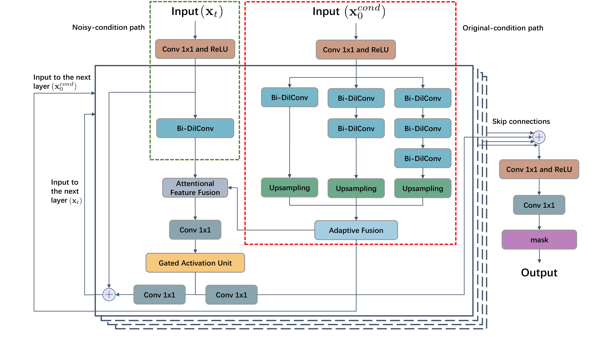

# WorkloadDiff (TCC 2024)


The repository is the official implementation for the paper: Weiping Zheng, Zongxiao Chen, Kaiyuan Zheng, Weijian Zheng, Yiqi Chen, Xiaomao Fan, "WorkloadDiff: Conditional Denoising Diffusion Probabilistic Models for Cloud Workload Prediction",  IEEE Transactions on Cloud Computing.

We have devised a two-path neural network tailored for cloud workload prediction. This network consists of four residual layers, with bidirectional dilated convolution (Bi-DilConv) serving as the fundamental building block. 
<div align=center>

</div>


## Prerequisites


Dependencies can be installed using the following command:


```shell
pip install -r requirements
```

## Usage


**Training and forecasting for the workload dataset.**

```shell
python exe_main.py --nsample [number of samples]
```


**Execute multiple times and calculate the average.**

```shell
sh exe_WorkloadDiff.sh
```

**Make predictions using a pre-trained model.**
```shell
python exe_main.py --modelfolder [model file path]

```

## Acknowledgement

We are grateful for the valuable codes in the following GitHub repositories, which have been instrumental in achieving our baseline results.

- **DeepAR**: https://github.com/arrigonialberto86/deepar
- **CSDI**: https://github.com/ermongroup/CSDI/tree/main
- **N-BEATS**: https://github.com/philipperemy/n-beats/tree/master
- **SARIMA**: https://github.com/krishnaik06/ARIMA-And-Seasonal-ARIMA/tree/master
- **LSTNet**: https://github.com/laiguokun/LSTNet/tree/master
- **WaveNet**: https://github.com/ZhouYuxuanYX/Wavenet-in-Keras-for-Kaggle-Competition-Web-Traffic-Time-Series-Forecasting/tree/master
- **LSTM**: We implement an LSTM model by ourselves.
The LSTM model comprises a single LSTM layer with 64 units, a
Fully-Connected layer with ReLU activation function, and a dropout ratio of
0.3.
- **CNN-LSTM**: We implement the model by ourselves. The model consists of a one-dimensional CNN with 32 filters and a kernel size
of 3, followed by max-pooling with a size of 2. The LSTM module includes a layer
with 64 units, a Fully-Connected layer, a dropout ratio of 0.3, and ReLU activation
function.
- **CEEMDAN-Informer**: We utilized the authors' official implementation and
requested the source code via email.

## Citation

